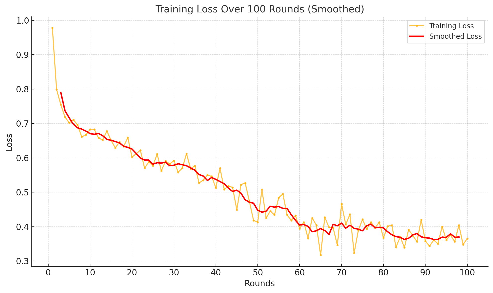

# FlowerTune LLM on Medical Dataset

This directory conducts federated instruction tuning with a pretrained [ContactDoctor/Bio-Medical-Llama-3-8B](https://huggingface.co/ContactDoctor/Bio-Medical-Llama-3-8B) model on a [Medical dataset](https://huggingface.co/datasets/medalpaca/medical_meadow_medical_flashcards).
We use [Flower Datasets](https://flower.dev/docs/datasets/) to download, partition and preprocess the dataset.
Flower's Simulation Engine is used to simulate the LLM fine-tuning process in federated way,
which allows users to perform the training on a single GPU.

## PEFT Adapter

The fine-tuning results have been submitted as a PEFT adapter and can be accessed here:

- [Bio-Medical-Llama-3-8B-peft_10]()

## Methodology

This experiment performs federated LLM fine-tuning with [LoRA](https://arxiv.org/pdf/2106.09685) using the [🤗PEFT](https://huggingface.co/docs/peft/en/index) library.
The clients' models are aggregated with FedProx strategy.

### Bio-Medical-Llama-3-8B

For the **Bio-Medical-Llama-3-8B** model, we adopted the following fine-tuning methodology:

- **Precision**: BF16 for model weights with TF32 for computation
- **Quantization**: 4-bit quantization to reduce memory footprint
- **Gradient Checkpointing**: Enabled to save memory during backpropagation
- **Optimizer**: Paged AdamW 8-bit
- **LoRA Configuration**:
  - Rank (r): 8
  - Alpha: 32
- **Batch Size**: 16 per device
- **Gradient Accumulation**: 1 step
- **Learning Rate**: Constant with warmup
  - Max: 1e-5
  - Min: 1e-6
- **Training Schedule**:
  - Warmup Steps: 2
  - Max Steps: 6
  - Epochs: 3
  - Max Gradient Norm: 1.0
- **Rounds**: 10 server rounds
- **Client Participation**: 15% of clients selected per round
- **Federation Type**: Local simulation with 20 supernodes
- **Resources per Client**: 6 CPUs, 1 GPU
- **Dataset**: Medical Meadow Medical Flashcards

When bf16 and tf32 are enabled, model weights are stored in bf16 format, while gradients are computed in half-precision and converted to full 32-bit precision for updates.

### Training Loss Visualization

Below is the training loss plot from the experiment:



This methodology enabled efficient fine-tuning within constrained resources while ensuring competitive performance.

### Evaluation Results

- **pubmedqa**: 0.6580
- **medqa**: 0.6031
- **medmcqa**: 0.6834
- **average**: 0.5367

### Communication Budget

23428 Megabytes

## Environments setup

Project dependencies are defined in `pyproject.toml`. Install them in an activated Python environment with:

```shell
pip install -e .
```

## Experimental setup

The dataset is divided into 20 partitions in an IID fashion, a partition is assigned to each ClientApp.
We randomly sample a fraction (0.15) of the total nodes to participate in each round, for a total of `100` rounds.
All settings are defined in `pyproject.toml`.

> [!IMPORTANT]
> Please note that `[tool.flwr.app.config.static]` and `options.num-supernodes` under `[tool.flwr.federations.local-simulation]` are not allowed to be modified for fair competition if you plan to participated in the [LLM leaderboard](https://flower.ai/benchmarks/llm-leaderboard).


## Running the challenge

Run the challenge with default config values.
The configs are defined in `[tool.flwr.app.config]` entry of `pyproject.toml`, and are loaded automatically.

```bash
flwr run
```

## Model saving

The global PEFT model checkpoints are saved every 5 rounds after aggregation on the sever side as default, which can be specified with `train.save-every-round` under [tool.flwr.app.config] entry in `pyproject.toml`.